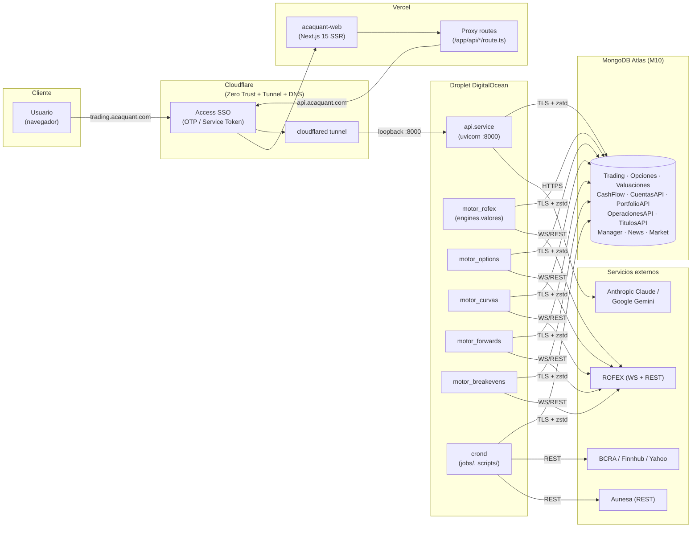
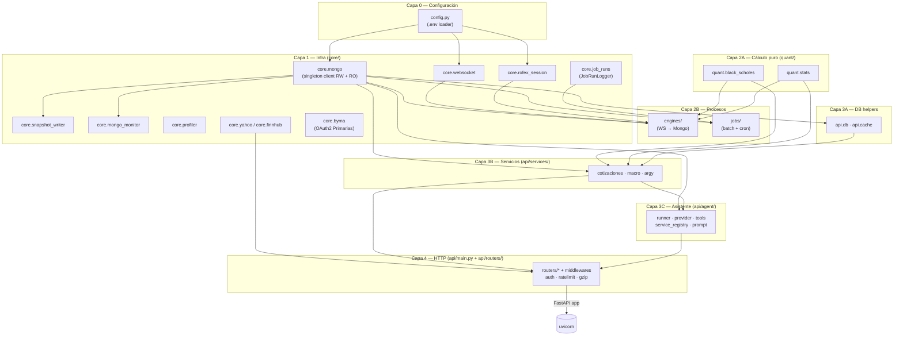
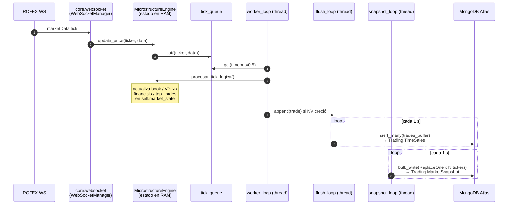
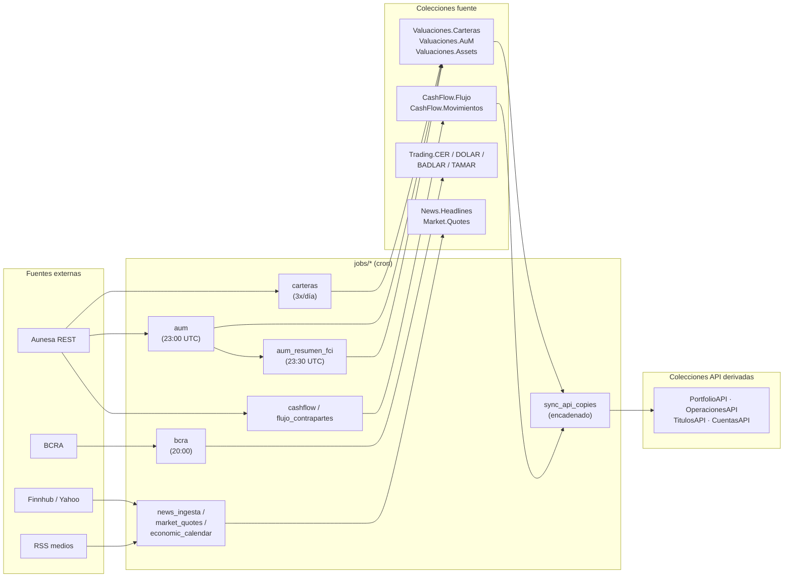
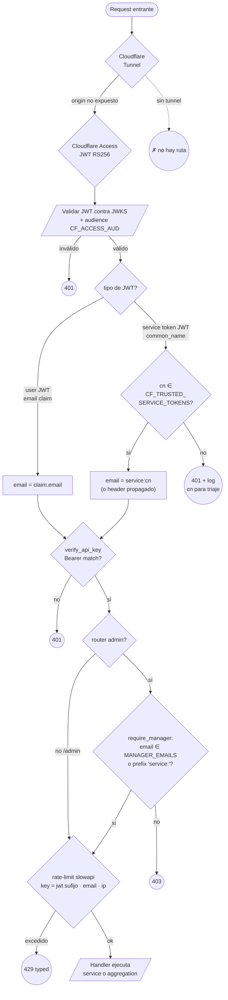
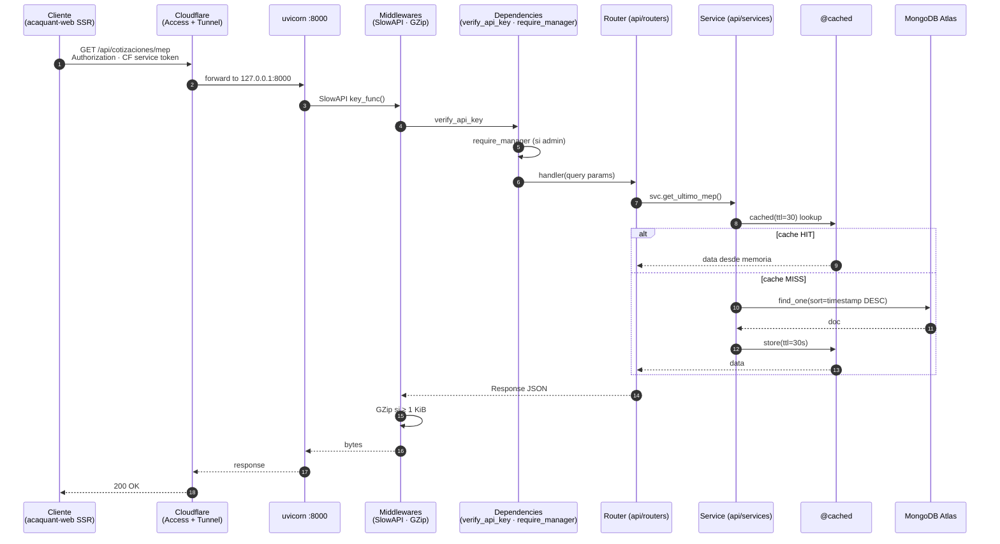
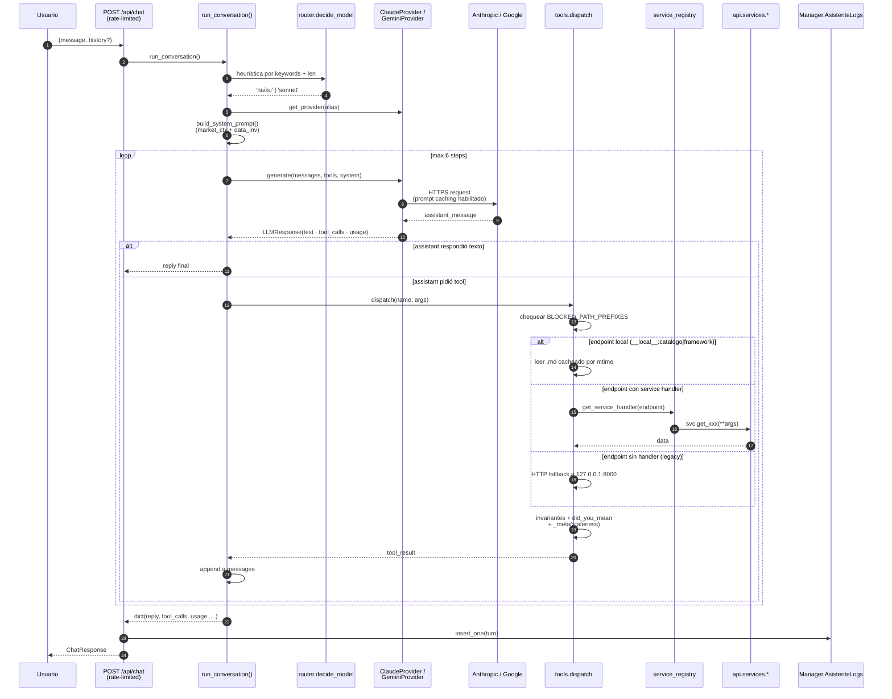
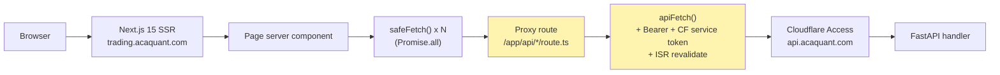

# Arquitectura — TradingAV

Documento de referencia del código actual. Describe cómo están organizados los módulos, cómo fluyen los datos y qué responsabilidad tiene cada capa. Los diagramas usan Mermaid (renderizan en GitHub, GitLab, VS Code y Obsidian).

---

## 1. Resumen

TradingAV es una plataforma cuantitativa para mercados argentinos (MERVAL/ROFEX) con tres responsabilidades:

1. **Ingesta en tiempo real** — motores always-on que reciben ticks de ROFEX por WebSocket, calculan métricas de microestructura y escriben a MongoDB Atlas.
2. **Procesamiento batch** — jobs cron que sincronizan posiciones desde Aunesa, calculan AuM diario, ingestan series macro (BCRA), producen rollups y mantienen copias derivadas (`*API.*API`) optimizadas para consumo externo.
3. **Servicio de datos + asistente** — API HTTP (FastAPI) consumida por el frontend `acaquant-web` y por un asistente conversacional IA (Claude/Gemini con tool-use sobre la propia capa de servicios).

El stack está físicamente repartido en tres planos: backend en una Droplet de DigitalOcean, frontend en Vercel, base de datos en MongoDB Atlas. Cloudflare une los tres con Tunnel + Access (Zero Trust).

---

## 2. Topología de deployment

**Comportamiento operativo:**

- El origin (`api.service`) no tiene IP pública; sólo es alcanzable a través del tunnel de Cloudflare. `cloudflared.service` es always-on.
- Los motores `motor_*.service` arrancan 13:00 UTC y se apagan 20:05 UTC L–V (rueda local 10:00–17:05 ART). Fuera de ese horario están detenidos.
- El cluster Atlas se pausa entre 04:00–11:30 UTC (01:00–08:30 ART) vía `deploy/atlas_cluster.sh`. Durante la pausa la API devuelve error de conexión.
- `acaquant-web` deploya en push a `main` (Vercel); no hay systemd ni Droplet involucrado.

---

## 3. Capas del código y reglas de dependencia

### Reglas observadas

| Permitido | Prohibido |
|---|---|
| `core/` no importa nada del proyecto (sólo stdlib / libs + `config`). | `core/` ↛ `api/`, `engines/`, `jobs/`, `quant/`. |
| `quant/` puede importar `core/` (p. ej. `black_scholes.py` lee VR-GGal). | `quant/` ↛ `api/`. |
| `engines/` y `jobs/` importan `core/` y `quant/`. | `engines/` ↛ `api/`. `jobs/` ↛ `api/`. |
| `api/services/` importa `api/db`, `api/cache`, `core/` y `quant/`. No importa `fastapi`. | `api/services/` ↛ `api/routers/`, `api/agent/`. |
| `api/agent/` importa `api/services/` y `core/`. | `api/agent/` ↛ `api/routers/`. |
| `api/routers/` importa `api/services/`, `api/agent/`, `api/auth`, `api/ratelimit`. | Lógica de negocio en routers. |

---

## 4. Ingesta en tiempo real — motores

Cada motor es un proceso independiente (systemd unit) que autentica contra ROFEX, suscribe tickers a través de un `WebSocketManager` y persiste a MongoDB. El único motor con arquitectura de cerebro + threads es `engines/valores.py`; el resto son loops de polling/agregación.

### Tabla de motores

| Motor | Origen | Destino | Cadencia | Mecanismo |
|---|---|---|---|---|
| `engines/valores.py` | ROFEX WS | `Trading.TimeSales` + `Trading.MarketSnapshot` | tick + snapshot 1 s | Cerebro con 3 threads (`worker_loop`, `flush_loop`, `snapshot_loop`). Warm-start desde REST + Mongo del día. Calcula VPIN por bucket de volumen, hourly stats, top trades. |
| `engines/options.py` | ROFEX WS | `Opciones.Data` + `Opciones.OptionsSnapshot` + `Opciones.Metadata` | tick + snapshot 1 s | Usa la clase local `MongoManager` (vive en este módulo, no en `core/`). Greeks con Black-Scholes y IV con Newton-Raphson. Lee tasa de `Metadata.config`. |
| `engines/curvas.py` | `Trading.TimeSales` (lectura) | `Trading.TimeSales` (update) | loop 5 s | Enriquece trades sin `duration` con TEA/TEM/Duration/Convexity/Paridad. Recarga CER cada 1 h. |
| `engines/forwards.py` | `Trading.TimeSales` agregada | `Trading.ForwardsLive` + `Trading.ForwardsHistorico` | loop 30 s | Matriz NxN por curva. Usa `duration` como horizonte. |
| `engines/breakevens.py` | `Trading.TimeSales` agregada | `Trading.BreakevensLive` + `Trading.BreakevensHistorico` | loop 30 s | Empareja cada Lecap con el CER de vencimiento más cercano (≤ 20 días de diferencia). |
| `engines/caucion.py` | ROFEX WS | `Trading.CaucionSnapshot` + `Trading.Caucion` | tick + snapshot 5 s | Suscribe los 2 tickers ROFEX (`PESOS - {N}D` + `DOLAR - {N}D`) con `N` = días al próximo hábil (lun-jue: 1, vie: 3, vie+lun feriado: 4). Replaces por moneda cada 5 s. Vuelca al cierre a `Trading.Caucion` (1 doc por fecha×moneda). |
| `engines/futuros_dlr.py` | ROFEX WS | `Trading.FuturosDLRSnapshot` + `Trading.FuturosDLR` | tick + snapshot 5 s | Discovery dinámico cada 5 min de outrights vigentes (`underlying='Dólar USA A3500'`, `cficode='FXXXSX'`, un solo `/`, sin sufijo `M`). Tasa implícita TNA calculada vs MEP spot del último `DolarSnapshot`. |
| `engines/dolares.py` | ROFEX WS | `Valuaciones.DolarSnapshot` | tick + snapshot 5 s | Suscribe AL30 / AL30D / AL30C; calcula MEP = offer/bid, CCL = offer/bid_C, canje = (CCL-MEP)/MEP·100. 1 doc fijo con `_id='current'` replaced cada 5 s. |
| `engines/dolar_mep.py` | ROFEX REST puntual | `Valuaciones.Dolar` | cron `*/15 13-20 L-V` | Calcula MEP+CCL+canje con snapshots REST cada 15 min. Escribe la serie histórica que alimenta `/api/cotizaciones/historico/mep` y los anchors de ARGY. Complementa `engines.dolares` (live en memoria) con la persistencia histórica. |

### Propiedades de la ingesta

- **Idempotencia.** Los snapshots usan `ReplaceOne(upsert=True)` / `update_one(upsert=True)` por clave (`ticker`, `symbol`, `curva`). Los reinicios no generan duplicados.
- **Aislamiento.** Cada motor corre como proceso propio (systemd unit con `WorkingDirectory=/root/TradingAV`, `ExecStart=.../python -m engines.<nombre>`). Dentro del proceso, la separación queue→worker→flush→snapshot evita que la I/O a Mongo bloquee el handler de WebSocket.
- **Cold recovery.** `MicrostructureEngine._arranque_en_frio` reconstruye `daily_financials` desde `Trading.TimeSales` al arrancar, recuperando el día operativo si el motor se reinicia intra-rueda.
- **Core infra.** Los singletons `get_mongo_client()` / `get_mongo_client_read()` son el único punto de acceso a Mongo (thread-safe, double-checked locking). Los consumidores nunca llaman `.close()` — cerrar el client mata el pool.

---

## 5. Procesamiento batch — jobs + cron

**Patrón de derivadas API**: las colecciones `*API.*API` son copias optimizadas (campos normalizados, índices propios) reconstruidas con `drop() + insert_many()` en `scripts/api_migrate.py`. `jobs/sync_api_copies.py` se encadena al final de cada job fuente en el crontab para que la API quede fresca sin intervención manual.

**Observabilidad**: cada job se envuelve en `core.job_runs.JobRunLogger` (context manager). El `__exit__` persiste un doc en `Manager.JobRuns` con duración, status (`ok|partial|error`), stats estructurados y últimas ~200 líneas de log. El índice TTL de 60 días vive en `scripts/crear_indices.py`.

---

## 6. Capa de seguridad de la API

Cuatro chequeos independientes en serie (`api/main.py`, `api/auth.py`, `api/ratelimit.py`). Una request tiene que pasar los cuatro para llegar a un handler.

**Detalles del código:**

- `api/auth.py::_jwks_client` cachea el `PyJWKClient` con `@lru_cache(maxsize=1)`. Las claves RS256 rotan por Cloudflare; PyJWKClient las refresca al detectar un `kid` desconocido.
- Si `CF_ACCESS_TEAM` o `CF_ACCESS_AUD` están vacíos, el módulo cae al header sin validar (modo dev). En prod ambos son obligatorios.
- Los service token JWT traen `common_name` en vez de `email`. El allow-list `CF_TRUSTED_SERVICE_TOKENS` evita que cualquier service token de la cuenta CF entre como "service:*". Cuando el service token no propaga email, `get_user_email()` devuelve el literal `service:<cn>` que `require_manager()` acepta.
- `api/deps.py::verify_api_key` compara un Bearer estático contra `API_KEY`. Si `API_KEY` está vacío, deja pasar todo (dev).
- `require_manager` se aplica a tres routers (`manager`, `manager_resources`, `chat`) vía `dependencies=[Depends(require_manager)]` en `api/main.py`. No se replica la verificación por endpoint.
- El rate-limit (`api/ratelimit.py`) usa los últimos 16 chars del JWT firmado como proxy de identidad. Evita re-validar criptográficamente en cada request. Quotas concretas: `/api/chat` 30/min · 500/día, `/api/manager/jobs/run` 5/h · 20/día.

---

## 7. Lifecycle de una request HTTP

**Detalles del código:**

- `@cached(ttl=N)` (en `api/cache.py`) vive en la capa de servicio, no en el router. Así tanto el handler HTTP como el asistente IA (que llama al service directo) comparten el mismo hit. La llave es `(module, fn_name, tuple(sorted(kwargs.items())))`.
- El decorador no cachea respuestas vacías (`None`, `[]`, `{}`) — síntoma de error transitorio (cluster pausado, query caída). Propagar ese estado durante TTL daña UX.
- TTLs por dominio: 5 s para snapshots de mercado, 30 s para MEP/forwards/breakevens, 300 s para portfolio, 3600 s para series BCRA históricas.
- Errores tipados: `/api/chat` y el handler del rate-limit (`_rate_limit_handler` en `api/main.py`) devuelven `{detail: {code, message, retryable, retry_after_s}}`. El resto usa la shape simple `{detail: "..."}`.
- El warmup del pool Mongo y el sampler de recursos (`manager_resources.resources_sampler_loop`) se arrancan en el `lifespan` de FastAPI.

---

## 8. Asistente IA — tool-use loop

**Detalles del código:**

- Política de datos: `BLOCKED_PATH_PREFIXES = ("/api/portfolio", "/api/operaciones", "/api/cuentas", "/api/manager")` en `api/agent/tools.py`. Los endpoints listados no se declaran al modelo (se filtran en `gemini_tool_declarations()`) y `dispatch()` los rechaza también si el modelo inventa el nombre. Defense in depth.
- `api/agent/service_registry.py` mapea `endpoint → función de servicio`. Cuando hay handler registrado, `dispatch()` llama la función Python directamente (sin loopback HTTP a `127.0.0.1:8000`). Ahorra DNS + socket + re-parse FastAPI + verify auth + re-serialización JSON. Si el endpoint no está registrado, cae a HTTP por compatibilidad.
- El runner (`api/agent/runner.py`) usa formato canónico estilo Claude. `GeminiProvider` traduce al formato Gemini al vuelo. `MAX_STEPS=6` acota el tool-use para controlar costo.
- El routing a modelo (`api/agent/router.py::decide_model`) es heurístico: regex sobre el mensaje del usuario + longitud. Triggers estratégicos (`comparame`, `recomendá`, `estructura`, etc.) activan Sonnet; el resto va a Haiku.
- Prompt caching activado en Claude: la declaración de tools se marca con `cache_control={"type": "ephemeral"}` en su último elemento (`_claude_tool_declarations` con `cache_last=True`).
- Cada turno (success, truncated, error) se persiste en `Manager.AsistenteLogs` desde `api/routers/chat.py::_log_interaccion`. El tab `/manager` ASISTENTE de acaquant-web consume `/api/manager/asistente/*` para rendear métricas en vivo.
- Tools locales (`__local__:framework`, `__local__:catalogo`) leen archivos `.md` editables (`docs/asistente/estrategia.md`, `docs/asistente/estrategias.md`) y se recachean por `mtime` — cambios no requieren restart.

---

## 9. Mapa de persistencia

| DB | Colección | Escritor | Lector primario | Notas |
|---|---|---|---|---|
| `Trading` | `TimeSales` | `engines.valores` (insert) + `engines.curvas` (update) | API `/cotizaciones/historico/*`, motores agregadores | Índices `(ticker, timestamp)` + variantes con campos enriquecidos. Campo `convexity` agregado. |
| `Trading` | `MarketSnapshot` | `engines.valores` (replace 1 s) | API `/cotizaciones/renta-fija` | 1 doc por ticker. |
| `Trading` | `ForwardsLive` / `ForwardsHistorico` | `engines.forwards` | API `/cotizaciones/forwards*` | Live = upsert por curva. Histórico = doc por (curva, fecha). |
| `Trading` | `BreakevensLive` / `BreakevensHistorico` | `engines.breakevens` | API `/cotizaciones/breakevens*` | Live = 1 doc global con `pares[]`. Histórico = 1 doc por fecha. |
| `Trading` | `CaucionSnapshot` | `engines.caucion` (replace 5 s) | API `/cotizaciones/caucion` | 1 doc por moneda (ARS/USD). `plazo_dias` dinámico según próximo hábil. |
| `Trading` | `Caucion` | `engines.caucion` al apagado | API `/historico/caucion`, tool `caucion_historica` | 1 doc por (fecha, moneda). Cierre diario. |
| `Trading` | `FuturosDLRSnapshot` | `engines.futuros_dlr` (replace 5 s) | API `/cotizaciones/futuros-dlr` | 1 doc por ticker. Tasa implícita TNA vs MEP spot. |
| `Trading` | `FuturosDLR` | `engines.futuros_dlr` al apagado | API `/historico/futuros-dlr` | 1 doc por (fecha, ticker). Cierre diario. |
| `Trading` | `Curvas` | manual + seeders | `engines.curvas`, `breakevens`, `forwards` | Definición estática de instrumentos. |
| `Trading` | `CER`, `DOLAR`, `BADLAR`, `TAMAR` | `jobs.bcra` | API `/cotizaciones/*` | Series macro BCRA. |
| `Opciones` | `Data` / `OptionsSnapshot` | `engines.options` (vía clase local `MongoManager`) | API `/cotizaciones/opciones*` | Ticks históricos + snapshot live. |
| `Opciones` | `Metadata` | `engines.options` + `PUT /api/cotizaciones/opciones/tasa` | engine on-demand | Tasa libre de riesgo + VR + expiries config. |
| `Opciones` | `DataHistorica` | `jobs.options_rollup` | analytics | Rollup diario. |
| `Opciones` | `VR-GGal` | `jobs.volatilidad_ggal` | `quant.black_scholes.calcular_hv_40_ruedas` | 40 ruedas + SUMMARY_METRICS. |
| `Valuaciones` | `Carteras` / `CarterasII` / `AuM` / `AuMResumenFCI` / `Assets` | `jobs.carteras`, `jobs.aum`, `jobs.aum_resumen_fci` | API `/portfolio/*`, `sync_api_copies` | Estado patrimonial. AuM cron 23 UTC. |
| `Valuaciones` | `DolarSnapshot` | `engines.dolares` (replace 5 s) | API `/cotizaciones/mep`, service `argy._live_dolar` | 1 doc fijo (`_id='current'`). MEP/CCL/canje live via WS. |
| `Valuaciones` | `Dolar` | `engines.dolar_mep` (cron 15 min) | API `/historico/mep`, anchors ARGY | Histórico diario + intradía (cron). |
| `CashFlow` | `Flujo` / `Movimientos` / `Contrapartes` / `Accionistas` | `jobs.flujo_contrapartes`, `jobs.cashflow`, manual | `sync_api_copies`, API `/cuentas/*` | Operaciones + entidades. |
| `CuentasAPI`, `OperacionesAPI`, `PortfolioAPI`, `TitulosAPI` | `*API` | `scripts.api_migrate` (vía `jobs.sync_api_copies`) | API `/cuentas/*`, `/operaciones/*`, `/portfolio/*`, `/titulos/*` | Copias derivadas. drop+insert, idempotente. |
| `Manager` | `JobRuns` | `core.job_runs.JobRunLogger` | API `/manager/jobs/history*` | TTL 60 d. |
| `Manager` | `ChangeLog` | manual / scripts | API `/manager/changelog` | Notas operativas. |
| `Manager` | `AsistenteLogs` | `routers.chat::_log_interaccion` | API `/manager/asistente/*` | Auditoría turnos IA. |
| `Manager` | `IntelDocs` | API `/manager/intel/*` | `agent.context` (último confirmado) | Reportes de research extraídos. |
| `News` | `Headlines` | `jobs.news_ingesta`, `jobs.news_finnhub` | API `/news*` | Feed Bloomberg-style. |
| `Market` | `Quotes` / `EconomicCalendar` | `jobs.market_quotes`, `jobs.market_anchors`, `jobs.economic_calendar` | API `/market/*` | Watchlist global + calendario. |

**Conexión a Atlas**: dos clientes singleton en `core/mongo.py` — `get_mongo_client()` (RW, motores y jobs) y `get_mongo_client_read()` (RO, `SECONDARY_PREFERRED`, usado por la API). Pool máximo 20 conexiones por cliente, compresión `zstd`/`snappy`/`zlib`, `serverSelectionTimeoutMS=30 000`. Los consumidores nunca cierran los clients — cerrarlos mata el pool.

---

## 10. Capa de presentación — acaquant-web

Resumen. El detalle completo vive en `CLAUDE.md`.

- El proxy de Next.js es donde vive `API_KEY` y los CF service tokens. El browser nunca los ve.
- `src/proxy.ts` restringe `/manager`, `/asistente` y `/api/chat` a los emails en `MANAGER_EMAILS`. Es el gate del lado cliente; `require_manager` cubre el server-side.
- ISR (Incremental Static Regeneration) cachea respuestas según el TTL pasado a `apiFetch`.

---

## 11. Convenciones del código

- **Timezone.** Todo timestamp persistido es UTC con `tzinfo` explícito (excepto colecciones legacy donde se documenta el TZ implícito ART). `datetime.now()` sin tz no se usa — se usa `datetime.now(UTC)` o `datetime.now(_AR_TZ)` según el caso.
- **Strings de fecha.** `YYYY-MM-DD` (ISO) en colecciones para permitir comparación lexicográfica eficiente.
- **Encoding.** UTF-8 en todos lados.
- **Naming Mongo.** DBs en PascalCase (`Trading`, `Valuaciones`, `CashFlow`), colecciones también (`TimeSales`, `MarketSnapshot`). Las copias API agregan sufijo `API` al nombre de la DB y de la colección (`PortfolioAPI.AumAPI`).
- **Ejecución.** Siempre `python -m <módulo>` desde la raíz. Motores en prod: `/root/TradingAV/venv/bin/python -m engines.<nombre>`.
- **Logs.** Archivos en `/root/TradingAV/logs/<job>.log` (append). Para lectura programática se prefieren `Manager.JobRuns` (batch) y `Manager.AsistenteLogs` (turnos IA).

---

*Última revisión: 2026-04-21 (post motores caución / futuros DLR / dolares + ARGY + Tier 2 analítica + scaffolding BYMA). Actualizar cuando cambien las capas, el deployment o la política de seguridad.*
