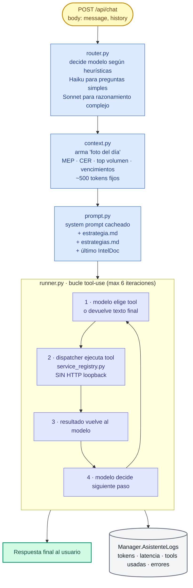

# Arquitectura — ACA Quant

Este documento explica qué es **ACA Quant** (repo: `TradingAV`), por qué existe, cómo está construido y cómo se conecta cada pieza. Está escrito para que lo entienda alguien sin perfil técnico.

---

## 1. Qué es y para qué sirve

**ACA Quant** es la plataforma cuantitativa interna de la mesa. Cubre **dos frentes complementarios** que comparten el mismo backend (FastAPI + MongoDB Atlas) y el mismo frontend (`acaquant-web`):

### 1.1 Mercados argentinos en tiempo real (MERVAL / MAE / ROFEX)

1. **Captura** datos de mercado en vivo (precios de bonos, opciones, dólares, futuros) directamente desde ROFEX y los guarda con timestamp.
2. **Calcula** métricas que el mercado no publica: tasas implícitas (TEA), duraciones, breakevens de inflación, forwards, paridades, griegas de opciones, retornos vs benchmarks, etc.
3. **Expone** todo eso a través de una página web (acaquant-web) y de un asistente de IA conversacional, para que la mesa pueda tomar decisiones con datos frescos y consistentes.

### 1.2 Información operacional para la dirección de la ALyC

ACA Quant también es **el panel de control que jefes y gerentes usan a diario** para entender qué pasa con el negocio. Esta capa se alimenta de la **API de Aunesa** (back-office de la ALyC) y resuelve preguntas como:

- ¿Cuántos **depósitos / extracciones** entraron hoy y quién los hizo? (`CashFlow.Movimientos`)
- ¿Qué **flujo operamos con cada contraparte**? ¿Cuánto nos operan los Fondos / ALYCs / Bancos en cada moneda? (`CashFlow.Flujo`)
- ¿Cuál es el **AuM (Assets under Management)** de cada cliente, segmentado por unidad (FCIs, bonos soberanos, futuros, etc)? (`Valuaciones.AuM`, `Valuaciones.AuMResumenFCI`)
- ¿Cuánto plata les **administramos a los Fondos** vs cuánto nos operan? (vista `/aum` cruzando flujo vs AuM — driver clave de la relación comercial).
- **Reportes de carteras de inversión** mensuales por cliente (vista `/portfolios`): valuación a fin de mes, rendimientos vs benchmarks (Badlar / A3500 / Inflación), composición por emisor y clase de activo. Hoy se consumen vía web; **el roadmap es exponerlos a ACA (la cooperativa) vía endpoints públicos de la propia REST API**.

### 1.3 El problema que resuelve

Antes, la mesa y la dirección armaban planillas Excel manualmente cruzando datos de múltiples fuentes (ROFEX, BCRA, **Aunesa**, prospectos PDF, Bloomberg, Reuters). Esas planillas se desactualizaban a los 5 minutos y dependían de que alguien estuviera al teclado. ACA Quant reemplaza ese flujo con una capa automatizada que vive en el servidor, se actualiza sola y sirve los mismos datos a todos los usuarios al mismo tiempo.

---

## 2. Lógica del negocio

ACA Quant cubre **dos universos de datos en paralelo**: lo que pasa **afuera** (mercados) y lo que pasa **adentro** (la operación de la ALyC).

### 2.1 Universo "mercado"

La mesa opera principalmente:

- **Renta fija ARS**: bonos en pesos a tasa fija (Lecaps, Boncaps), bonos CER (atados a inflación), TAMAR.
- **Renta fija USD**: Globales (ley NY, ej. GD30D, GD35D) y Bonares (ley argentina, ej. AL30D, AO27D).
- **Dólar financiero**: MEP, CCL, canje, oficial (BCRA A3500).
- **Caución bursátil**: tasas de financiamiento corto plazo en pesos y dólares.
- **Futuros DLR** (ROFEX): curva de futuros sobre el dólar mayorista.
- **Opciones** sobre GGAL: griegas, volatilidad implícita, breakevens.

Decisiones típicas:

- ¿Qué bono CER conviene comprar para superar una inflación esperada del 2% mensual?
- ¿La curva de pesos está empinada o invertida? ¿Qué dice eso del mercado?
- ¿Cuánto está pagando el mercado por "el año pos-elecciones" (riesgo político implícito)?
- ¿El canje (CCL/MEP) está en niveles históricos de stress?

### 2.2 Universo "interno" (back-office vía Aunesa)

Aunesa es el sistema de back-office que registra todo lo que pasa en la ALyC: posiciones de clientes, depósitos, extracciones, operaciones del día con cada contraparte. ACA Quant tira contra **la API de Aunesa** (`jobs/aunesa_client.py`) para reconstruir esto en MongoDB y servirlo a la dirección.

Dominios que cubre:

- **Carteras de clientes**: posiciones diarias por cuenta y unidad (`Valuaciones.Carteras`, `Valuaciones.CarterasII`).
- **AuM (Assets under Management)**: snapshot diario por `(cuenta, unidad, fecha)` con la valuación recalculada según las reglas de cada tipo de activo (`Valuaciones.AuM`, `Valuaciones.AuMResumenFCI`). Incluye Fondos de Inversión (FCI), bonos, futuros, etc.
- **Cash Flow** (depósitos / extracciones): movimientos de tesorería de cada cliente (`CashFlow.Movimientos`).
- **Flujo con contrapartes**: operaciones del día con cada contraparte clasificadas por segmento ("Fondos" / "ALYC" / "Bancos") y moneda (`CashFlow.Flujo` + `CashFlow.Contrapartes`).
- **Reportes de carteras**: informes mensuales por cliente que cruzan la cartera del último día con los rendimientos del mes y los benchmarks (`Valuaciones.Benchmarks`, `Valuaciones.Rendimientos`).

Decisiones típicas:

- ¿Mi cartera FCI rindió más o menos que la inflación este mes?
- ¿Cuánto **nos operan los Fondos** este mes vs cuánto **les administramos**? (esto guía la conversación comercial: "te traemos X de AuM, esperamos Y de flujo de operación").
- ¿Qué accionistas hicieron movimientos esta semana? (filtros "Solo accionistas" / "Solo cooperativas" / "Sin accionistas" en `/operaciones`).
- ¿Cómo evolucionó el AuM total del último mes? ¿Por qué subió/bajó? (`/aum` con drill-down).

Este universo es **tan crítico como el de mercado** — sin él, la dirección pierde la foto del negocio. Y es la base sobre la que se va a construir la **API pública para ACA**: la cooperativa va a poder consultar reportes de las carteras que administramos vía endpoints autenticados, sin tener que pedirlos por mail.

### 2.3 Cómo se conecta todo

ACA Quant estructura los datos de los dos universos para que cada pregunta tenga una respuesta concreta en pantalla y/o un endpoint que la devuelva — y, cada vez más, una respuesta del asistente IA en lenguaje natural.

---

## 3. Tech stack

| Capa | Tecnología | Por qué |
|---|---|---|
| Datos en tiempo real | **pyRofex** (WebSocket) | API oficial del mercado argentino. Push de cada trade en milisegundos. |
| Base de datos | **MongoDB Atlas M10** | Document store, ideal para shapes heterogéneos (un trade tiene campos distintos a un snapshot de opción). Cluster gestionado, replicado, con backups automáticos. |
| Backend cálculo | **Python 3.12** | Stack maduro para cuantitativo (numpy, pandas, scipy implícitos en pyRofex). Fácil de versionar y testear. |
| API REST | **FastAPI** | Async, auto-genera OpenAPI/Swagger, validación con tipos. |
| Frontend | **Next.js 15 + React 19 + Tailwind 4** | Server-side rendering para velocidad, componentes reactivos para charts en vivo. |
| Charts | **Recharts** + **Lightweight Charts** | Recharts para tablas y series; Lightweight Charts (TradingView) para velas. |
| Hosting backend | **DigitalOcean Droplet** | VPS dedicado, control total, predecible en costos. |
| Hosting frontend | **Vercel** | Deploy automático en cada push, edge cache global, preview environments. |
| Acceso/seguridad | **Cloudflare Tunnel + Cloudflare Access** | Cero puertos abiertos al mundo; OTP por email para entrar; service tokens para máquina-a-máquina. |
| IA generativa | **Anthropic Claude** (Haiku/Sonnet) + **Google Gemini** (fallback) | Tool-use para que el modelo consulte datos en lugar de inventarlos. |
| Datos externos | **Yahoo Finance, Finnhub, BCRA, dolarapi.com, Aunesa, MAE, BYMA** | Cada uno cubre un dominio: equities mundiales, calendario económico, macro AR, dólares minoristas, posiciones de clientes, secundario MAE, licitaciones primarias. |

---

## 4. Componentes principales

ACA Quant se divide en cuatro grupos lógicos:

### 4.1 Motores (`engines/`)

Procesos que **viven todo el día** consumiendo el WebSocket de ROFEX. Cada motor escucha un universo de tickers, calcula algo y persiste.

| Motor | Qué hace | Frecuencia |
|---|---|---|
| `valores` | Captura cada trade de bonos (TimeSales) y arma snapshot del libro (MarketSnapshot). | Tick + 1s |
| `curvas` | Enriquece cada trade con TEA, duración, convexidad, paridad. | 5s |
| `options` | Calcula greeks Black-Scholes y volatilidad implícita para opciones GGAL. | Tick |
| `forwards` | Arma matriz NxN de tasas forward implícitas por curva. | 30s |
| `breakevens` | Calcula inflación mensual implícita CER vs Lecap. | 30s |
| `caucion` | Persiste la caución del próximo día hábil (ARS y USD). | 5s |
| `futuros_dlr` | Curva de futuros DLR con tasa implícita TNA. | 5s |
| `dolares` | MEP/CCL/canje en vivo desde el WS (AL30/AL30D/AL30C). | 5s |

Los motores corren como **systemd services**. Arrancan automáticamente a las 13:00 UTC (10:00 ART) y se apagan a las 20:05 UTC (17:05 ART), de lunes a viernes. Cuando el mercado está cerrado, no consumen recursos.

### 4.2 Jobs batch (`jobs/`)

Tareas programadas que **no escuchan WebSocket** — corren puntualmente y terminan. Se invocan vía cron. La fuente de verdad de qué corre cuándo es **`deploy/crontab.txt`**.

Se dividen en tres familias:

**a) Pipeline Aunesa (back-office ALyC)** — la columna vertebral del universo "interno":

| Job | Qué hace | Frecuencia |
|---|---|---|
| `jobs.aunesa_client` | Cliente HTTP (auth + paginación + retries) que el resto importa. No corre solo. | — |
| `jobs.carteras` | Sincroniza posiciones de TODAS las cuentas activas en `Valuaciones.Carteras`. | 3×/día (11:35, 14:00, 16:00 UTC) |
| `jobs.aum` | Snapshot AuM del día por `(id_cuenta, unidad)`. Aplica reglas de valuación (`÷100` para renta fija, `(P+1)×Q` para futuros, `P×Q` resto). Sincroniza `Valuaciones.CarterasII` al final. | 23:00 UTC |
| `jobs.aum_resumen_fci` | Rollup 1 doc por `fecha_snapshot` con totales por unidad (~22 docs vs ~2.4k raw). | 23:30 UTC |
| `jobs.aum_backfill` | Re-ejecutable, reconstruye AuM por fechas pasadas. | manual |
| `jobs.cashflow` | Depósitos / extracciones del día → `CashFlow.Movimientos`. | 02:00 UTC (Mar-Sáb) |
| `jobs.flujo_contrapartes` | Operaciones del día por contraparte → `CashFlow.Flujo`. | 22:00 UTC L-V |
| `jobs.segmento_contrapartes` | Asigna `segmento` ("Fondos" / "ALYC" / "Bancos") en `CashFlow.Contrapartes`. | manual |

**b) Macroeconómicos / mercado complementario**:

- `jobs.bcra` (CER, TAMAR, DOLAR A3500, BADLAR) — 20:00 UTC.
- `jobs.dolar_mep` — cron intradía cada 15 min como complemento del motor live.
- `jobs.options_rollup` — rollup `Opciones.Data` → `Opciones.DataHistorica` post-cierre (20:15 UTC).
- `jobs.volatilidad_ggal` — VR histórica al cierre (20:00 UTC).
- `jobs.market_quotes` / `jobs.market_anchors` — watchlist global (Yahoo + Treasuries) y anchors 7d/MTD/YTD/1Y.
- `jobs.cleanup_curvas` — purga instrumentos vencidos de `Trading.Curvas` (12:30 UTC L-V).
- `jobs.dias_habiles` — calendario hábil argentino (1×/año).

**c) Sincronización de colecciones API derivadas**:

- `jobs.sync_api_copies` — encadena `scripts.api_migrate <comando>` después de cada job fuente (carteras, movimientos, flujo, AuM, títulos). Sin esto, las colecciones `*API.*API` (que es lo que la API REST y el frontend leen) quedan desactualizadas. **Ver sección 4.4**.

**d) Otros**:

- `jobs.news_ingesta` (RSS) cada 15 min, `jobs.news_finnhub` cada 30 min, `jobs.economic_calendar` (Finnhub).
- `jobs.backfill_forwards` — reconstruye `Trading.ForwardsHistorico` desde TimeSales enriquecido.

### 4.3 API REST (`api/`)

FastAPI que escucha en `127.0.0.1:8000` (no expuesta directo a internet — entra solo a través del Cloudflare Tunnel). Sirve **~70 endpoints** agrupados en routers:

- `/api/cotizaciones/*` — precios live e históricos (renta fija, dólares, opciones, futuros, caución).
- `/api/analitica/*` — análisis: listar curva, serie macro, sensibilidad, **canje**, **carry trade**, pendiente, liquidez secundario.
- `/api/portfolio/*` — carteras y AuM (vista admin).
- `/api/operaciones/*` — flujos y movimientos de tesorería (vista admin).
- `/api/manager/*` — observabilidad y control (status de motores, jobs, logs del asistente).
- `/api/news` — feed de noticias unificado (RSS + Finnhub).
- `/api/market/*` — quotes globales, calendario económico, candles Yahoo.
- `/api/chat` — endpoint del asistente de IA (ver sección 6).

La API tiene tres capas internas:

- **Routers** (`api/routers/`): definen las rutas HTTP y los parámetros.
- **Services** (`api/services/`): la lógica pura (sin FastAPI). Cada función es testeable de manera aislada y cacheada con `@cached(ttl=N)` cuando corresponde.
- **DB helpers** (`api/db.py`): un singleton de conexión Mongo con `read_preference=SECONDARY_PREFERRED` (la API no escribe, solo lee).

### 4.4 Colecciones API derivadas (puente Aunesa ↔ FastAPI)

Las colecciones que escriben los jobs (`Valuaciones.Carteras`, `Valuaciones.AuM`, `CashFlow.Flujo`, `CashFlow.Movimientos`, etc.) son **la fuente de verdad**, pero tienen el shape que conviene para escribirse rápido desde Aunesa — no necesariamente el shape óptimo para que la API y el frontend las consuman.

Por eso existe una capa intermedia: `scripts/api_migrate.py` toma cada colección fuente y produce una **copia derivada** en una DB con sufijo `API`:

| Origen (escrito por jobs) | Destino (leído por la API / frontend) | Comando migrate |
|---|---|---|
| `Valuaciones.Carteras` | `PortfolioAPI.CarterasAPI` | `carteras` |
| `Valuaciones.AuM` | `PortfolioAPI.AumAPI` | `aum` |
| `Valuaciones.Assets` | `TitulosAPI.AssetsAPI` | `assets` |
| `CashFlow.Flujo` | `OperacionesAPI.MesaAPI` | `flujo` |
| `CashFlow.Movimientos` | `OperacionesAPI.FlujosAPI` | `movimientos` |
| `CashFlow.Contrapartes` | `CuentasAPI.ContrapartesAPI` | `contrapartes` + `mover` |
| `CashFlow.Accionistas` | `CuentasAPI.AccionistasAPI` | `accionistas` + `mover` |
| `Trading.Curvas` + `Trading.BondsMaster` | `TitulosAPI.ValuacionesAPI` | `flujos-titulos` |

`jobs.sync_api_copies` orquesta esto en cron — cada job que toca una colección fuente dispara la re-sync correspondiente. Esta capa es la **base sobre la que se construirá la API pública para ACA** (las colecciones `*API` ya están pensadas para consumo externo).

### 4.5 Frontend (`acaquant-web`, repo separado)

Next.js 15 deployado en Vercel. Vive en `trading.acaquant.com`.

**Páginas principales**:

| Ruta | Contenido |
|---|---|
| `/` | Home con feed de noticias y top ticker (MEP/CCL/canje/caución). |
| `/renta-fija` | Cotizaciones live, gráfico de curvas (TASA FIJA / CER / GLOBALES con LIVE+HISTÓRICO), forwards, breakevens, libro. |
| `/derivados` | Opciones GGAL con griegas, IV, breakevens, simulador de estrategias. |
| `/retorno` (label "ESTRATEGIA") | Cuatro tabs: **Retorno Total**, **Análisis Sensibilidad**, **Canje**, **Carry Trade**. |
| `/operaciones` | Flujos de tesorería filtrables (admin). |
| `/portfolios` | Reportes mensuales por cuenta vs benchmarks (admin). |
| `/aum` | Evolución de AuM por moneda y desglose por cartera (admin). |
| `/asistente` | Chat con el asistente IA (admin). |
| `/manager` | Observabilidad: status motores, jobs, logs del asistente, INTEL (research extraído) (admin). |

El frontend nunca habla directo con la API pública — pasa siempre por **API routes proxy** de Next (en `src/app/api/`), que añaden el Bearer token + service token de Cloudflare antes de llamar al backend. Eso oculta credenciales del browser.

---

## 5. Diagrama de flujo

Hay **dos pipelines de ingesta independientes** que aterrizan en el mismo MongoDB y se sirven al mismo frontend.

```mermaid
flowchart TB
    %% ───────── PIPELINE A: MERCADO ─────────
    subgraph PA["⚡ PIPELINE A · MERCADO LIVE (always-on, L-V horario de mercado)"]
        direction TB
        ROFEX([ROFEX WebSocket<br/>mercado live])
        WSM[core/websocket.py<br/>WebSocketManager<br/>chunks de 50 tickers]
        ROFEX --> WSM

        subgraph ENGINES["8 motores en paralelo (systemd)"]
            direction LR
            E1[valores<br/>1s]
            E2[options<br/>tick]
            E3[curvas<br/>5s]
            E4[forwards<br/>30s]
            E5[breakevens<br/>30s]
            E6[caucion<br/>5s]
            E7[futuros_dlr<br/>5s]
            E8[dolares<br/>5s]
        end

        WSM --> ENGINES
        COL_A[(Trading.* · Opciones.*<br/>Valuaciones.Dolar*)]
        ENGINES --> COL_A
    end

    %% ───────── PIPELINE B: AUNESA ─────────
    subgraph PB["📋 PIPELINE B · INTERNO ALyC (cron batch vía Aunesa)"]
        direction TB
        AUNESA([Aunesa REST API<br/>back-office ALyC])
        CLI[jobs/aunesa_client.py<br/>cliente HTTP compartido]
        AUNESA --> CLI

        subgraph JOBS["Jobs cron (deploy/crontab.txt)"]
            direction LR
            J1[carteras<br/>3×/día]
            J2[aum<br/>23:00 UTC]
            J3[cashflow<br/>02:00 UTC]
            J4[flujo_contrapartes<br/>22:00 UTC]
            J5[aum_resumen_fci<br/>23:30 UTC]
        end

        CLI --> JOBS
        COL_B[(Valuaciones.Carteras · CarterasII<br/>Valuaciones.AuM · AuMResumenFCI<br/>CashFlow.Movimientos<br/>CashFlow.Flujo · Contrapartes)]
        JOBS --> COL_B
    end

    %% ───────── PUENTE ─────────
    BRIDGE[scripts/api_migrate.py<br/>+ jobs/sync_api_copies<br/><br/>re-sync idempotente]
    COL_A --> BRIDGE
    COL_B --> BRIDGE
    DERIVED[(CuentasAPI · PortfolioAPI<br/>OperacionesAPI · TitulosAPI<br/><br/>colecciones derivadas optimizadas para lectura)]
    BRIDGE --> DERIVED

    %% ───────── CONSUMO ─────────
    MONGO[(MongoDB Atlas M10)]
    DERIVED --> MONGO
    API[FastAPI · ~70 endpoints<br/>get_mongo_client_read SECONDARY_PREFERRED<br/>@cached ttl=60–300]
    MONGO --> API
    CF[Cloudflare Tunnel + Access<br/>JWT validado + service tokens whitelisted]
    API --> CF
    WEB[acaquant-web · Next.js / Vercel<br/>trading.acaquant.com]
    CF --> WEB
    USER([👤 Usuario<br/>mesa · dirección · futuro: ACA])
    WEB --> USER

    %% ───────── ESTILOS ─────────
    classDef external fill:#fef3c7,stroke:#d97706,stroke-width:2px,color:#78350f
    classDef engine fill:#dbeafe,stroke:#2563eb,stroke-width:1px,color:#1e3a8a
    classDef job fill:#e0e7ff,stroke:#6366f1,stroke-width:1px,color:#312e81
    classDef storage fill:#f3f4f6,stroke:#6b7280,stroke-width:2px,color:#111827
    classDef bridge fill:#fce7f3,stroke:#db2777,stroke-width:2px,color:#831843
    classDef serve fill:#d1fae5,stroke:#059669,stroke-width:2px,color:#064e3b
    classDef user fill:#fef9c3,stroke:#ca8a04,stroke-width:2px,color:#713f12

    class ROFEX,AUNESA external
    class WSM,E1,E2,E3,E4,E5,E6,E7,E8 engine
    class CLI,J1,J2,J3,J4,J5 job
    class COL_A,COL_B,DERIVED,MONGO storage
    class BRIDGE bridge
    class API,CF,WEB serve
    class USER user
```



**Por qué dos pipelines**: el mercado se rompe si pierde un tick, así que vive en motores `always-on` con WebSocket. Aunesa solo refresca lo que cambió hoy (carteras, movimientos, operaciones del día), así que vive en cron batch. Ambos terminan en el mismo MongoDB, pero la cadencia, las garantías y los puntos de falla son distintos — por eso conviene pensarlos por separado.

**Lectura rápida**:
1. **Pipeline A**: ROFEX → `WebSocketManager` → 8 motores paralelos → colecciones `Trading.*`, `Opciones.*`, `Valuaciones.Dolar*`.
2. **Pipeline B**: Aunesa API → jobs cron → colecciones `Valuaciones.*` y `CashFlow.*`.
3. **Puente**: `scripts/api_migrate.py` produce copias derivadas `*API.*API` optimizadas para lectura externa.
4. La API REST lee solo las copias derivadas (siempre `read-only`) y expone endpoints.
5. El frontend pasa por Cloudflare Tunnel y Access; nunca toca el servidor directo.

---

## 6. El asistente de IA

Esto es lo más distintivo del proyecto. Está en `api/agent/` y se expone vía `POST /api/chat`.

### 6.1 Qué hace

Un usuario de la mesa puede preguntar en lenguaje natural cosas como:

- "¿Cómo está la curva CER comparada con hace una semana?"
- "Mostrame los breakevens vs la inflación esperada del REM."
- "¿Qué Lecap conviene si esperás 1.8% de inflación los próximos 3 meses?"
- "Resumime las novedades macro del último IntelDoc cargado."

Y el modelo responde con datos **reales y actuales**, no generados.

### 6.2 Cómo lo logra (en una línea)

El modelo no inventa datos: el sistema le da un **menú de "tools"** (funciones que devuelven datos reales). El modelo decide qué tool llamar, el sistema la ejecuta, le devuelve el resultado, y el modelo redacta la respuesta.

### 6.3 Arquitectura interna



### 6.4 Qué datos consume

El modelo tiene acceso a **17 tools agrupadas en 3 grupos**:

**Grupo 1 — datos públicos seguros** (lectura libre):
- `listar_curva` — todos los bonos de una curva con TEA/duration/paridad.
- `serie_macro` — serie histórica de cualquier variable (CER, MEP, CCL, canje, dólar oficial, caución, BADLAR, TAMAR).
- `clasificar_nivel` — wrapper compacto que dice "este nivel está en el percentil 80 de los últimos 90 días".
- `snapshot_curva_historico` — reconstruye una curva entera para un día específico.
- `calcular_pendiente_curva` — slope entre dos puntos de una curva.
- `liquidez_secundario` — volumen promedio de un ticker en N días.
- `argy_overview` — agregador MEP/CCL/canje/caución con returns.

**Grupo 2 — derivados de mercado público**:
- `breakevens_actual` — inflación implícita CER vs Lecap.
- `forwards_curva` — matriz forward NxN.
- `historico_curva` — serie diaria de una curva.

**Grupo 3 — bloqueado por política** (no expuesto al modelo):
- Cartera, AuM, operaciones, manager. El sistema tiene un **doble cinturón**: estos prefijos (`/api/portfolio/*`, `/api/operaciones/*`, `/api/cuentas/*`, `/api/manager/*`) están filtrados al declararle las tools al modelo Y bloqueados de nuevo en el dispatcher por si algo se cuela.

### 6.5 Cómo se "entrena"

**No se entrena en el sentido tradicional (no hay fine-tuning).** El comportamiento se moldea por tres archivos editables sin tocar código:

| Archivo | Qué configura |
|---|---|
| `docs/asistente/estrategia.md` | El "ADN analítico" de la mesa: framework de 4 capas (microestructura, valuación, contexto macro, narrativa), house view, señales que la mesa mira. |
| `docs/asistente/estrategias.md` | Catálogo técnico de ~45 estrategias por asset class (rolls, switches, hedge ratios, etc). |
| `Manager.IntelDocs` (Mongo) | Reportes de research que el equipo carga vía la vista `/manager → INTEL`. El último confirmado se inyecta automáticamente al contexto. |

Cuando se modifica cualquiera de los `.md`, el sistema lo detecta por mtime y los relee — **no hace falta reiniciar nada**.

### 6.6 Modelos usados

| Provider | Modelo | Cuándo |
|---|---|---|
| **Anthropic Claude** | Haiku 4.5 | Default para preguntas simples (~75% del tráfico). Rápido y barato. |
| **Anthropic Claude** | Sonnet 4.6 | Para preguntas que requieren razonamiento sobre datos (escala automática). |
| **Google Gemini** | Flash 2.5 | Fallback legacy + extracción estructurada de IntelDocs. |

Selector automático en `router.py` mira las heurísticas del mensaje (longitud, palabras clave de análisis, comandos explícitos) y decide.

### 6.7 Observabilidad

Cada turno (mensaje → respuesta) se loggea en `Manager.AsistenteLogs` con:
- mensaje del usuario
- modelo elegido
- tools llamadas + resultados
- tokens consumidos
- latencia
- error si lo hubo

La vista `/manager → ASISTENTE` muestra esos logs en vivo: filtros, expand de cada turno, charts de tokens y latencia.

---

## 7. Seguridad

Es importante porque la mesa maneja datos de clientes y posiciones reales. La defensa está estructurada en capas:

### 7.1 Cero puertos abiertos al mundo

El servidor en DigitalOcean no expone ninguna IP pública. Toda conexión entrante pasa por el **Cloudflare Tunnel** (`cloudflared.service` corre always-on). El tunnel mantiene una conexión saliente persistente con Cloudflare; los pedidos llegan vía esa conexión. Si alguien escanea el IP del Droplet, no encuentra ningún servicio escuchando.

### 7.2 Cloudflare Access (autenticación)

Antes de que un request pueda siquiera llegar al servidor, **Cloudflare Access** valida la identidad del usuario:
- Pide email del usuario.
- Manda OTP por email (one-time password).
- Si la validación es OK, emite un JWT firmado.

El backend valida **ese JWT criptográficamente** en `api/auth.py` (no confía en el header spoofable). Si el JWT no está, el request se rechaza con 401.

### 7.3 Service tokens (máquina-a-máquina)

El frontend (acaquant-web en Vercel) no es un humano — necesita pasar por Cloudflare Access automáticamente. Para eso usa un **service token** (un par client-id/secret permanente).

El backend tiene una **whitelist de service tokens "confiables"** (`CF_TRUSTED_SERVICE_TOKENS`): si llega un service token de la lista, se acepta. Cualquier otro service token (aunque haya pasado Cloudflare Access) se rechaza con 401 + log de warning con el `common_name` para triaje.

### 7.4 Bearer token (capa adicional)

Encima de Cloudflare Access, cada request a la API debe traer un header `Authorization: Bearer <API_KEY>`. Es una segunda llave que vive en variables de entorno; si Cloudflare Access cayera, esto sigue protegiendo.

### 7.5 Autorización por rol

Las rutas `/api/manager/*`, `/api/chat` y `/manager`/`/asistente` (frontend) están limitadas a una **whitelist de emails** (`MANAGER_EMAILS`). El gate ocurre tanto en el frontend (Next proxy en `src/proxy.ts`) como en el backend (`require_manager` dependency en FastAPI). Si el email del JWT no está en la lista, se rechaza con 403.

### 7.6 Política de datos sensibles para el asistente

El asistente IA tiene un **doble cinturón** sobre prefijos prohibidos (`/api/portfolio/*`, `/api/operaciones/*`, `/api/cuentas/*`, `/api/manager/*`):
1. Las tools que apuntan a esas rutas se filtran ANTES de declararse al modelo (el modelo ni siquiera "ve" que existen).
2. El dispatcher revalida en runtime — si alguna tool fuera filtrada se cuela, el dispatch la bloquea con error.

Esto evita que un prompt injection o un bug de declaración exponga data de clientes.

### 7.7 Rate limiting

Slowapi (`api/ratelimit.py`) limita por identidad (no por IP — la IP siempre es Cloudflare):
- `/api/chat`: 30 requests/min, 500/día.
- `/api/manager/jobs/run`: 5/h, 20/día.
- Resto: sin límite (lectura barata).

### 7.8 Otros

- **SSRF block** en `/api/news/article` (lector de URLs): valida hostname, bloquea IPs privadas.
- **Validación de inputs** vía Pydantic en todos los endpoints.
- **Read-only DB user** para la API (`MONGO_URI_READ`). La API no puede escribir aunque quiera.
- **No se loggean credenciales** ni JWTs ni Bearer tokens.
- **Backups automáticos** de MongoDB Atlas (snapshots cada 6h, retención 7 días).
- **Atlas pause** nocturna (01:00–08:30 ART): el cluster se pausa cuando nadie opera, ahorra ~31% del compute y elimina ventana de ataque cuando nadie monitoriza.

---

## 8. Documentos complementarios

Si esto te dejó dudas en algún tema específico, mirá:

| Doc | Contenido |
|---|---|
| `docs/API.md` | Contrato completo de cada endpoint (request, response, errores, ejemplos). |
| `docs/API_MIGRATIONS.md` | Cómo se construyen las colecciones API derivadas. |
| `docs/ASISTENTE.md` | Detalle profundo del módulo IA: troubleshooting, roadmap, evals. |
| `CLAUDE.md` | Guía de operación para devs (cómo arrancar, comandos, deploy). |

> **Nota sobre el nombre**: el producto se llama **ACA Quant**. El repositorio Git se llama `TradingAV` por razones históricas (era el nombre cuando arrancó el proyecto). Cualquier mención a "TradingAV" en código, paths o systemd services se refiere al repo, no al producto.

---

## Cómo se ven los diagramas

Los diagramas están escritos en **Mermaid**. Se renderizan automáticamente como imagen en:

- **GitHub** y **GitLab** (al ver el archivo en la web).
- **VS Code** con la extensión [Markdown Preview Mermaid Support](https://marketplace.visualstudio.com/items?itemName=bierner.markdown-mermaid).
- **Notion**, **Obsidian**, **Cursor**, **Claude.ai** (al pegar el bloque).
- **Vercel** si se renderiza el `.md` en una página Next con un plugin de mermaid.

Si querés exportar a PNG/SVG (por ejemplo para slides), pegá el bloque ` ```mermaid ` en [https://mermaid.live](https://mermaid.live) y descargalo desde ahí.
